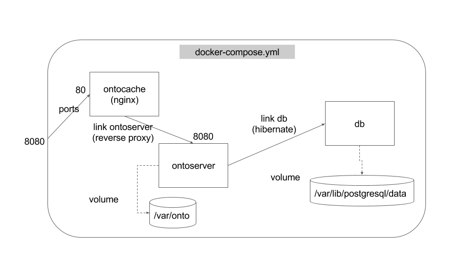

# Example Ontoserver deployment with horizontal scaling

This project provides an example deployment for [Ontoserver](https://ontoserver.csiro.au). It uses an NGINX cache in addition to the default Ontoserver deployment described at https://ontoserver.csiro.au/docs.

The deployment in the default docker-compose file looks like this:

To add HTTPS support:
 * Add your fullchain and private key files to ontocache/conf/certs/
 * Edit ontocache/conf/snippets/ssl-your.domain.here.conf (and if you rename the file, make sure you fix /ontocache/conf/nginx.conf to match)
 * Edit docker-compose to expose the cache's port 443 as 8443 instead of port 80 as 8080

# How does it work?

Firstly, this deployment runs Ontosever in a **read only** mode.  Thus you will need to have previsouly run it with writes enabled to populate the database with content.

Looking at the diagram you will see there are two types of Ontoserver instance: a single stateful instances and one or more stateless instances.
The stateless instances provide the horizontal scaling.  The Ngunx cache is configured to route the requests to the appropriate instances, and can provide TLS if required.

The stateful instance is there to support _read only_ interactions that nevertheless intrinsically establish state in the instance.
Rather than introduce the need for _sticky routing_ so that subsequent related requests go to the same instance, a single instance is used for all of these kinds of requests.

The first two of the stateful operations are `_search` and `_history` -- due to the way paging is specified in FHIR, the URLs for the previous and next page of results are specific to the instance that generated the current result page.

The third stateful operation is `$closure` -- this is because it creates a notion of shared or synchonrised state between the client and the server.

For most deployments one could expect that both `_search` and `_history` have a relatively low-volume of requests, are not response-time critical, and thus can be served by a single instance.
Things are slightly different for `$closure` -- it is not yet a commonly used operation, but it would not be surprising that if it were used, then it might get a high-volume of requests.
In this case, scaling can be done using the stateless instances by using the `name` parameter as a _sharding key_ such that all `$closure` requests with the same value for `name` are routed to the same stateless instance.

Note also that because Ontoserver only supports a select set of operations in a `batch` request, it can be handled by the stateless instances.

