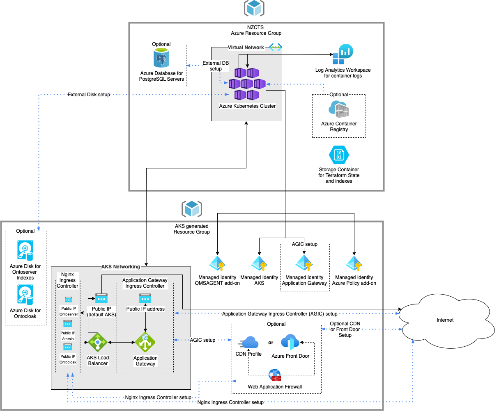

# Ontoserver deployment on Microsoft Azure Cloud Services

This example creates a recommended environment in Azure that exposes Ontoserver running on an Azure Kubernetes Services (AKS) cluster.

#### Resource Groups created by the setup
Two Azure Resource Groups are created by this example to hold the infrastructure required for the Ontoserver deployment. 

A main Resource Group holds the actual Azure Kubernetes Service and its associated networking, Log Analytics and other resources. 

An additional Resource Group is also be created by AKS that holds Managed Identities, Public IP addresses, a Load Balancer, optional Application Gateway and other resources required by AKS.

Any Azure resources (e.g.: disks) that will be accessed from an AKS pod should exist in the generated Resource Group otherwise Role Policies and Assignments needed to be set up for the Kubernetes Service Principal to access those resources in another group (including the main Resource Group).

#### Architecture diagram
This is the architecture diagram for the sample deployment with the expected Azure resources.

>Please note that Application Gateway Ingress Controller (AGIC) and Nginx ingress controller can exist in the same setup. These ingress controllers are deployed by Helm/AKS not the Terraform scripts.



#### Generated Azure Resources

##### Azure Kubernetes Service (AKS)
Ontoserver and its supporting services are built as Docker Containers. It's advised to run Ontoserver on a Kubernetes Cluster that allows easy configuration, monitoring and scaling. This deployment uses Azure Kubernetes Services. The service is created in the main Resource Group.

##### Managed identities
Multiple Managed Identities are created by the deployment. One is created for AKS itself so it can create/access resources in Azure. 
The others identities are also AKS related. One is for the Application Gateway Ingress Controller (if deployed) and the others are installed by the AKS add-ons: OMSAGENT - for monitoring and AZUREPOLICY - for managing and reporting compliance state in AKS.

##### Virtual Network
The deployment creates an Azure Virtual Network for the Kubernetes Cluster and also used by the Application Gateway if deployed. The virtual network has two subnets, one for Kubernetes and one for the optional Application Gateway created by Application Gateway Ingress Controller.
AKS is set up with the Azure CNI Network plugin (CNI is used instead of Kubenet) so a VNET routable private IP is assigned for the Pods that the Application Gateway can talk to.
Using Kubenet plugin or a different (peered) Virtual Network for the Application Gateway requires a different Setup.
More on this here: https://azure.github.io/application-gateway-kubernetes-ingress/how-tos/networking/

##### Public IP addresses
There are Public IP addresses created for the sample deployment in the AKS generated Resource Group. One for the Application Gateway Ingress Controller if it's used in the setup and one for the Kubernetes service's Load Balancer. 
The AKS Load Balancer created Public ip address is needed because of a limitation described at https://docs.microsoft.com/en-us/azure/aks/load-balancer-standard#limitations

Additional Public IP addresses are generated if Nginx ingress controller is used to expose the AKS services. In our example deployment we use Nginx Ingress Controller to expose Ontoserver so we can generate Azure managed DNS name and no custom domain name is required.

##### Load Balancer
A Load Balancer is created by the AKS installation in the AKS generated Resource Group to provide outbound connectivity for the AKS nodes. A Public IP is attached to the Load Balancer for this reason (see above). The optional Nginx Ingress Controller uses this Load Balancer for networking.

##### Network security group
A Network Security Group is created for the AKS networking functions when installing a Azure Kubernetes Service. This is created in the AKS generated Resource Group.

##### Azure Container Registry
An optional Azure Container Registry is part of this setup. It can be used to store specific or customised versions of Ontoserver images and a more secure way of storing and accessing these images instead of getting them from the original source at [Quay.io](https://quay.io).

##### Azure Disks
By design Ontoserver creates Lucene indexes in the container's file system that are used for searching and other functionality. These indexes are throw away and can be rebuilt but they get very large depending on the content. An empty index directory can slow down the server startup process significantly.
For production Ontoserver instances it is advised to persist these indexes on an attached container volume.

Instead of setting up an expensive managed Azure Postgres Database server the database can be provided on the AKS cluster via a Pod. For production systems it's advised to have the database stored on an Azure Disk via an attached volume for persistence.

For easy installation the Azure Disk resources should be set up in the AKS generated Resource group. 

##### Azure Database for PostgreSQL single server
Ontoserver requires a Postgres Database as a backend storage. For production systems it's advised to use a managed database service for backups and high availability. 
Our Helm charts provide the possibility of running a database pod on AKS by setting `ontoserver.database.external` to `false`. By default the Terraform deployment creates an Azure managed Postgres database.

##### Azure Log Analytics Solution and Workspace
An Azure Log Analytics Workspace and Solution is created by this deployment for storing container Logs. Container logs get deleted whenever a Pod crashes or restarted. Azure Log Analytics helps up preserve these logs for later inspection.

##### Application Gateway and Web Application Firewall {#agic}
An [Application Gateway Ingress Controller (AGIC)](https://azure.github.io/application-gateway-kubernetes-ingress) with an attached Web Application Firewall can be part of the setup.

AGIC can be used for the TLS termination and routing of Web traffic to the Ontoserver services and an attached Web Application Firewall can be used to secure network traffic. Please note that Spring library used in the development of Ontoserver comes with a basic security built in for malicious URLs/etc.

If AGIC is used in the setup it's advised to use a custom wildcard domain or multiple domains for the exposed services. The Application Gateway's Public IP address only allows one Azure generated domain name. Otherwise you will have to host your exposed PODs/services in different paths on the same domain.

If Web Application Firewall is enabled for the setup please note that Azure only allows 128kb request body size that is way to small for Ontoserver functionality. There could be large CodeSystems/ValueSets or Maps POSTed to Ontoserver so this limitation would not allow to upload them. Request Body inspection should be turned off on the WAF profile to go around this issue.

>Please note the use of Application Gateway with WAF can be very expensive. It adds the bulk of the cost to the infrastructure so care should be taken during setup. 
>The Application Gateway can be omitted and a CDN profile can be used for the TLS termination instead for a cheaper solution. With upcoming releases of Azure CDN an attached Web Application Firewall Policy can be used to add more security to the network.

##### Azure Front Door/CDN profile
It is advised to add a caching solution in front of Ontoserver as some of Ontoserver's responses can be quite large or calculated and it can have a performance impact on the server. 
This example includes a sample Azure CDN setup using Akamai profile.

Unfortunately Azure Front Door Standard caching setup is not suitable for Ontoserver as Azure Front Door Standard drops "Accept*" headers from the requests that are forwarded to Ontoserver. This "feature" is mentioned in Azure Docs GitHub issues at [https://github.com/MicrosoftDocs/azure-docs/issues/86858](https://github.com/MicrosoftDocs/azure-docs/issues/86858)

## Deployment
### [Terraform scripts](https://terraform.io)
#### Initial setup
The Terraform scripts require an Azure Resource Group and a Storage Container to be set up to store the Terraform state file and infrastructure resources like the AKS itself. 
Setting up the Resource Group and the Storage Container can be done manually but the [terraform/step_1_azure_storage_tf_backend/create_tfstate.storage.sh](terraform/step_1_azure_storage_tf_backend/create_tfstate_storage.sh) script helps with all the setup and settings.

Terraform requires Azure CLI to be installed on the computer/vm where it's being executed and the CLI needs to be authenticated with Azure `az login`
https://registry.terraform.io/providers/hashicorp/azurerm/latest/docs/guides/azure_cli

It's also required to have the proper Azure Storage Account and Storage Container details along with the account key for Terraform to connect to Azure. This information is shown in the `create_tfstate_storage.sh` script output but these details can be accessed through the Azure Portal.

The environment variable `ARM_ACCESS_KEY` must be set to the correct Azure Storage Account key and make sure to set the proper `storage_account_name` and `container_name` Terraform variables in [terraform/step_2_infrastructure/backendconfig.tfvars](terraform/step_2_infrastructure/backendconfig.tfvars) file.
>The `terraform.tfvars` file is used to overwrite settings in `variables.tf`. It's mainly used to pass secrets to Terraform and usually it isn't stored in a source repository.

After this setup you can run `terraform init --backend-config=backendconfig.tfvars` to initialise the Terraform state on Azure.

>It is advised to use a Managed Identity or a Service Principal to authenticate with Azure when running Terraform non-interactively for example from a build pipeline. 

####  Azure Container Registry (ACR)
In case of using an Azure Container Registry as a source of the docker images, the AKS cluster must be able to access the specified ACR. The Terraform scripts set up an ACR with the appropriate Role Assignment for this reason.

In case an existing ACR is desired to be used it can be attached to the AKS cluster at any time. Here is an example how to attach an existing ACR called `ontoserverexampleacr` to the AKS Cluster with the Azure CLI.
```
az aks update --name onto-example-k8s --resource-group ontoexample_resourcegroup --attach-acr ontoserverexampleacr
```
A shell script is provided to do the above: [terraform/attach-acr.sh](terraform/attach-acr.sh)

The installation of the ACR can be turned off in Terraform by setting the Terraform variable `acr_enabled=false`.

#### Application Gateway Ingress Controller (AGIC) Kubernetes add-on
A default AGIC Kubernetes add-on is set up by the Terraform scripts in the Kubernetes generated resource group. This can be disabled by setting `enable_app_gateway_ingress` Terraform variable to false.

To use a pre-existing Application Gateway modify [terraform/aks.tf](terraform/aks.tf) to look like following code snippet and set `enable_app_gateway_ingress` to false in [terraform/step_2_infrastructure/variables.tf](terraform/step_2_infrastructure/variables.tf)
```
...
  enable_ingress_application_gateway = var.enable_app_gateway_ingress
  ingress_application_gateway_id = [The existing application gateway id]
  ingress_application_gateway_name = [The name of the existing application gateway]
...
```
The Terraform scripts do not set up Web Application Firewall on the Application Gateway because the used AKS module doesn't expose those settings.
WAF needs to be enabled manually on the generated Application Gateway `aks-agw` in the Kubernetes generated resource group.

