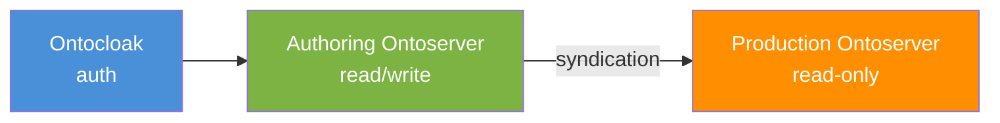
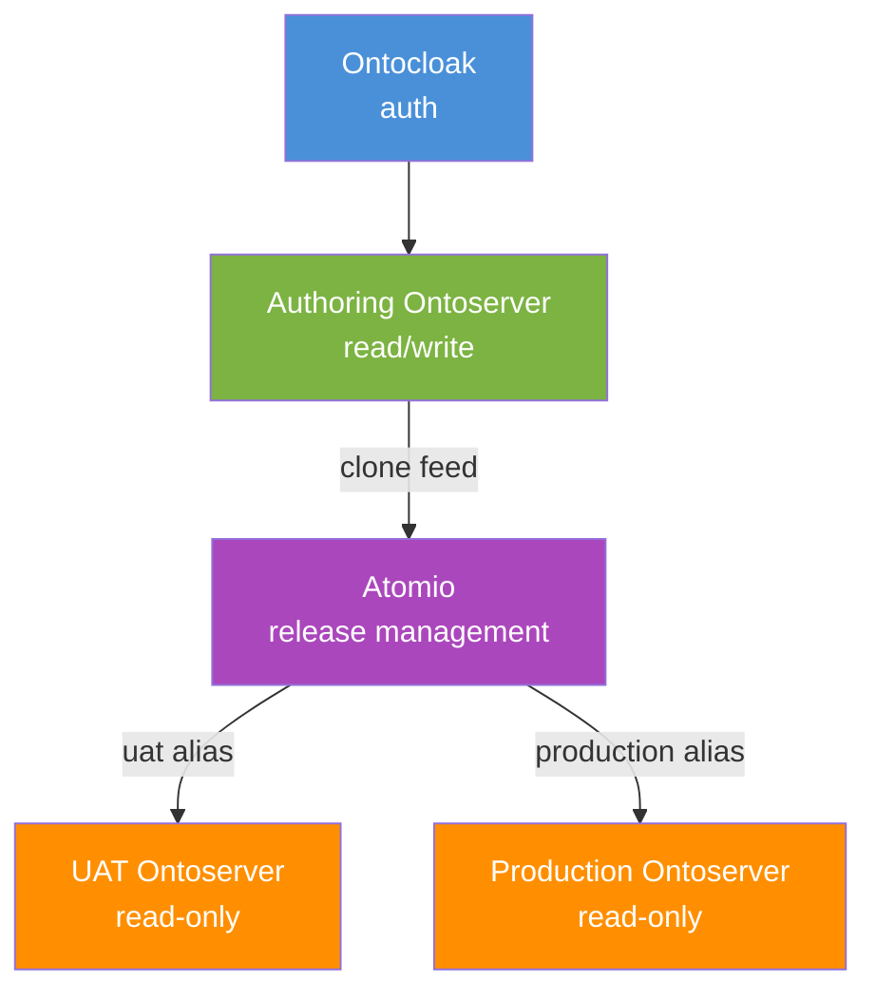

# Pathology Permissions Demo

A comprehensive demonstration of resource-level permissions for collaborative terminology authoring using [Ontoserver](https://ontoserver.csiro.au), [Ontocloak](https://ontoserver.csiro.au/site/our-solutions/ontocloak/), and [Atomio](https://ontoserver.csiro.au/site/our-solutions/atomio/).

## Scenario

Multiple pathology providers each maintain their own local order codes that need to be mapped to a **shared national pathology reference set**. Each group must:

- **See** the national reference set but not modify it
- **Create and edit** their own local CodeSystems and ConceptMaps
- **Not see** other groups' local resources
- Have distinct **roles**: viewers (read-only), authors (read/write), and approvers (can release content)

A third group maintains their terminology data as **CSV files in Git**, with an automated pipeline that transforms and loads the content.

## Two Variants

### Simple (`simple/`)

Direct syndication from authoring to production:



Best for understanding the core concepts of resource-level permissions and syndication.

### Atomio (`atomio/`)

Release candidate management through Atomio:



Adds release candidate creation, UAT testing, promotion/rollback, and the CSV-to-Atomio pipeline.

## Quick Start

### Prerequisites

- Docker and Docker Compose
- Access to `quay.io/aehrc` container registry (Ontoserver, Ontocloak, Atomio images)
- `bash`, `curl`, `jq`, `python3` installed locally
- Node.js and npm (for visual walkthroughs only)

### HTTPS and Self-Signed Certificates

All services are accessed via HTTPS with self-signed certificates. On first visit, your browser will show a certificate warning -- accept/trust it to proceed. You will need to do this once for each port (9081, 9082, etc.).

For `curl`, use the `-k` flag to skip certificate verification:

```bash
curl -k https://localhost:9081/fhir/metadata
```

### Linux and macOS

Install the prerequisites via your package manager (e.g. `apt`, `brew`, `dnf`). For the visual walkthrough, Playwright may require additional system libraries — run `npx playwright install-deps` if browser launch fails.

### Windows Users

The demo scripts are written in bash and require a Unix-like shell. On Windows, use one of:

**WSL 2 (recommended):**

1. Install [WSL 2](https://learn.microsoft.com/en-us/windows/wsl/install) with Ubuntu: `wsl --install`
2. Install Docker Desktop and enable the **WSL 2 backend** in Settings > General
3. Inside WSL, install the prerequisites: `sudo apt update && sudo apt install -y curl jq python3`
4. Clone the repo inside WSL (e.g. `~/Projects/ontoserver-deploy`) — not on the Windows `/mnt/c/` filesystem, as this causes performance issues with Docker volumes
5. Run all commands from the WSL terminal

**Git Bash (limited):**

Git Bash (bundled with [Git for Windows](https://gitforwindows.org/)) can run the demo scripts if `curl`, `jq`, and `python3` are on your PATH. Install them via [Chocolatey](https://chocolatey.org/): `choco install curl jq python3`. Docker Desktop must be installed and running. Note: Git Bash may have issues with terminal colours and interactive prompts in the walkthrough — WSL is preferred.

### Using the Demo Script

Everything is controlled through a single entry point — `demo.sh`:

```bash
./demo.sh <command> <variant>
```

| Command | Description |
|---------|-------------|
| `setup` | Start Docker services and configure the environment |
| `walkthrough` | Run the interactive visual walkthrough in a browser |
| `status` | Show running services and health checks |
| `teardown` | Stop all services and remove data volumes |

| Variant | Description |
|---------|-------------|
| `simple` | Authoring + Production (direct syndication) |
| `atomio` | Authoring + Atomio + UAT + Production (release management) |

Run `./demo.sh` with no arguments to see full usage and available URLs.

### Simple Example

```bash
./demo.sh setup simple     # ~5 minutes
```

After setup, open:
- **Ontocloak Admin**: https://localhost:9090/auth/admin (admin/admin)
- **Shrimp** (authoring): https://ontoserver.csiro.au/shrimp?iss=https://localhost:9081/fhir&clientId=shrimp
- **Shrimp** (production): https://ontoserver.csiro.au/shrimp?iss=https://localhost:9082/fhir&clientId=shrimp
- **Snapper** (authoring): https://ontoserver.csiro.au/snapper?iss=https://localhost:9081/fhir&clientId=snapper
- **Ontoserver Dashboard**: https://ontoserver.csiro.au/ui?iss=https://localhost:9081/fhir&clientId=onto-ui

### Atomio Example

```bash
./demo.sh setup atomio     # ~8 minutes
```

After setup, additionally open:
- **Atomio API**: https://localhost:9083/swagger-ui/index.html
- **Atomio UI**: https://localhost:9083 (redirects to the cloud-hosted Atomio UI)
- **Shrimp** (UAT): https://ontoserver.csiro.au/shrimp?iss=https://localhost:9084/fhir&clientId=shrimp
- **Shrimp** (production): https://ontoserver.csiro.au/shrimp?iss=https://localhost:9082/fhir&clientId=shrimp
- **Snapper** (authoring): https://ontoserver.csiro.au/snapper?iss=https://localhost:9081/fhir&clientId=snapper

### Visual Walkthrough

After setup, run the visual walkthrough to see each demo scenario in a browser:

```bash
./demo.sh walkthrough simple       # Interactive — pauses at each scene
./demo.sh walkthrough simple --auto  # Auto mode — runs through all scenes
./demo.sh walkthrough atomio       # Atomio variant (13 scenes)
```

The walkthrough opens a Chromium browser and steps through login flows, permission checks, governance workflows, and syndication — demonstrating everything described in the documentation.

## Demo Users

All users have the password `demo`.

| User | Role | Can See | Can Edit |
|------|------|---------|----------|
| `admin` | Full administrator | Everything | Everything |
| `national-admin` | National admin | Everything (approver) | National valueset |
| `alpha-viewer` | Pathology Alpha viewer | National + Alpha resources | Nothing |
| `alpha-author` | Pathology Alpha author | National + Alpha resources | Alpha resources |
| `alpha-approver` | Pathology Alpha approver | National + Alpha resources | Alpha resources + syndication |
| `beta-viewer` | Pathology Beta viewer | National + Beta resources | Nothing |
| `beta-author` | Pathology Beta author | National + Beta resources | Beta resources |
| `beta-approver` | Pathology Beta approver | National + Beta resources | Beta resources + syndication |

## Documentation

| Document | Description |
|----------|-------------|
| [Architecture](docs/architecture.md) | System architecture, design decisions, and component interactions |
| [Key Concepts](docs/concepts.md) | Explanation of security labels, communities, syndication, and the permission model |
| [Simple Walkthrough](docs/walkthrough-simple.md) | Step-by-step guide for the simple example |
| [Atomio Walkthrough](docs/walkthrough-atomio.md) | Step-by-step guide for the Atomio variant |

## Teardown and Reset

```bash
# Tear down and remove all data
./demo.sh teardown simple
./demo.sh teardown atomio
```

This stops all Docker services and removes data volumes. To re-run a demo after completing it, you must tear it down first — the setup script expects a clean environment.

You can also check service health at any time:

```bash
./demo.sh status simple
./demo.sh status atomio
```

## Port Reference

All services use HTTPS with self-signed certificates.

| Port | Service | Variant | URL |
|------|---------|---------|-----|
| 9090 | Ontocloak (authorization) | Both | `https://localhost:9090` |
| 9081 | Authoring Ontoserver | Both | `https://localhost:9081` |
| 9082 | Production Ontoserver | Both | `https://localhost:9082` |
| 9083 | Atomio | Atomio | `https://localhost:9083` |
| 9084 | UAT Ontoserver | Atomio | `https://localhost:9084` |
