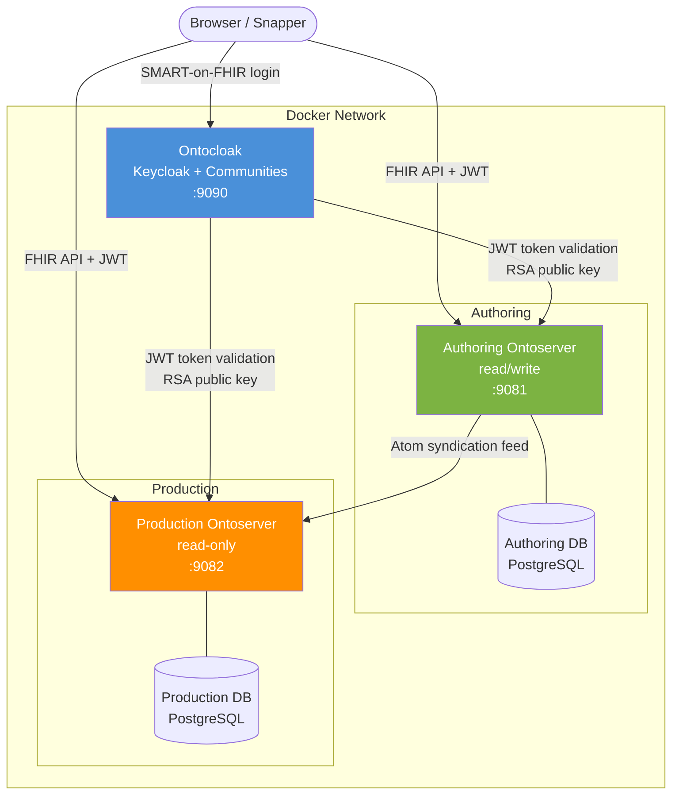
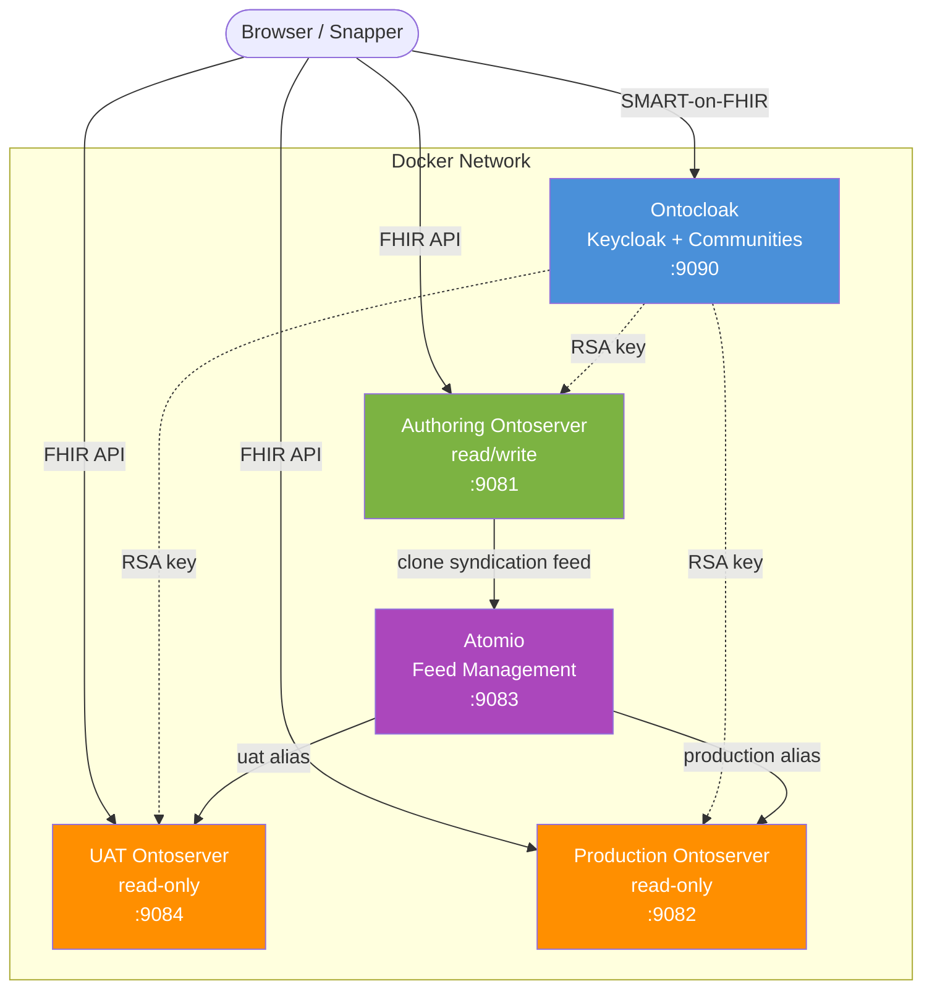
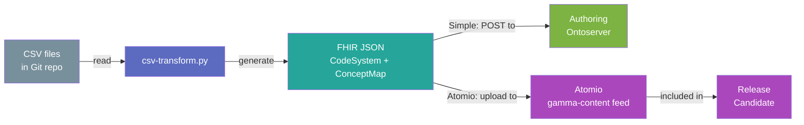
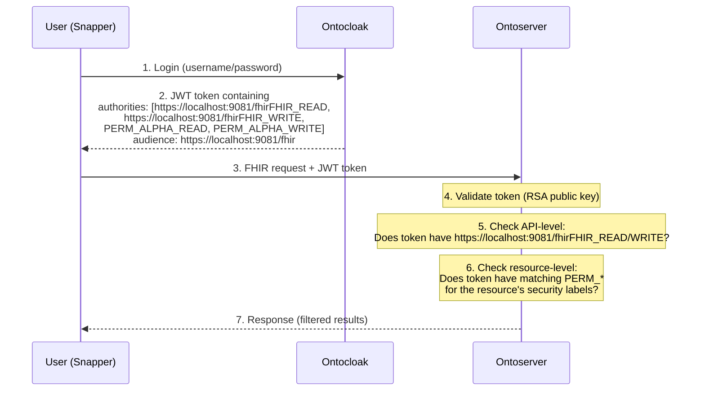

# Architecture

This document explains the system architecture, design decisions, and component interactions for the pathology permissions demo.

## Overview

The demo models a real-world scenario where multiple pathology providers collaborate on terminology mapping through a shared Ontoserver instance while maintaining strict isolation of their proprietary content.

## Components

### Ontocloak (Authorization Server)

**Role**: Authentication and authorization via OAuth2/OIDC

Ontocloak is a Keycloak-based authorization server with extensions for community management. It provides:

- **User authentication**: Login via username/password (in production, federated via SAML/OIDC/LDAP)
- **Community management**: Creates and manages user communities that map to Ontoserver's resource-level security labels
- **Token issuance**: JWT tokens containing user roles and community permissions
- **SMART-on-FHIR**: Authorization flow for Snapper (Ontoserver's web UI)

When a community is created (e.g., "Pathology Alpha" with security label "ALPHA"), Ontocloak automatically creates:
- Realm roles: `PERM_ALPHA_READ`, `PERM_ALPHA_WRITE`, `PERM_ALPHA_OWNER`
- Groups: "Pathology Alpha authors", "Pathology Alpha consumers", "Pathology Alpha owners"
- Role assignments: Authors get READ+WRITE, consumers get READ only

### Authoring Ontoserver (Read/Write)

**Role**: Primary terminology authoring environment

Configuration highlights:
- `ontoserver.security.enabled=fine` - Enables resource-level security
- `atom.syndication.publish.enabled=true` - Publishes content for downstream consumption
- `atom.syndication.publish.fhir.enabled=selected` - Only resources with syndication status = true appear in the feed. New resources are draft by default and must be explicitly approved.
- `atom.syndication.publish.fhir.secureSyndicated=true` - Modifying a syndicated resource requires `SYND_WRITE` permission (the Approver role). Authors with only `FHIR_WRITE` get 403 Forbidden. This prevents accidental changes to production-published content.
- `ontoserver.security.readOnly.synd=true` - Makes the syndication feed XML (metadata) publicly readable without requiring `SYND_READ`/`FHIR_WRITE` authority. This is needed because downstream syndication consumers (production, Atomio) authenticate with `https://localhost:9081/fhirFHIR_READ` + `PERM_READ` only. The FHIR resources referenced in feed entries still require proper OAuth authentication.

> **Note:** Because `readOnly.synd=true` is set, the `syndication-consumer` service account does not need `https://localhost:9081/fhirSYND_READ`. If `readOnly.synd` were `false` (the default), the consumer would also require `SYND_READ` authority to access the syndication feed metadata.

The authoring server validates JWT tokens from Ontocloak using the realm's RSA public key. Each FHIR resource can carry security labels in `meta.security` that control access:

```json
{
  "meta": {
    "security": [
      { "system": "http://ontoserver.csiro.au/CodeSystem/ontoserver-permissions", "code": "ALPHA.read" },
      { "system": "http://ontoserver.csiro.au/CodeSystem/ontoserver-permissions", "code": "ALPHA.write" }
    ]
  }
}
```

### Production Ontoserver (Read-Only)

**Role**: Released terminology for consumption

Configuration highlights:
- `ontoserver.deployment.readOnly=true` - Rejects all write operations
- `ontoserver.security.readOnly.fhir=true` - Anonymous read access to the FHIR API
- `ontoserver.security.enabled=fine` - Resource-level security still applies

The production server syncs content from the authoring server (simple variant) or Atomio (Atomio variant) via Atom syndication feeds. The syndication consumer authenticates using a `syndication-consumer` service account with OAuth2 client credentials. This account has `PERM_READ` (all communities read) so it can access all community-labeled resources from the upstream server.

Security labels are preserved through syndication, so community isolation is maintained on production. Anonymous users can access resources labeled with `*.read` (like the national valueset). Authenticated users see additional resources based on their community memberships.

### Atomio (Release Candidate Server)

**Role**: Manages curated content releases between environments (Atomio variant only)

Atomio is a syndication server that hosts terminology content as entries in Atom feeds. Key concepts:

- **Feeds**: Named collections of content entries (e.g., "release-1-0", "release-2-0")
- **Feed cloning**: Creates a snapshot by cloning another feed (e.g., from the authoring syndication)
- **Aliases**: Stable URLs that point to specific feeds (e.g., "uat" -> "release-2-0")
- **Entries**: Individual content items with downloadable artefacts

### UAT Ontoserver (Read-Only, Atomio variant)

**Role**: Testing environment for release candidates

Syncs from Atomio's "uat" alias. Allows testing of new content before it reaches production.

## Architecture Diagrams

### Simple Variant



**Browser access:**
- `https://localhost:9090/auth` - Ontocloak admin console
- `https://ontoserver.csiro.au/snapper?iss=https://localhost:9081&clientId=snapper` - Authoring Snapper
- `https://ontoserver.csiro.au/snapper?iss=https://localhost:9082&clientId=snapper` - Production Snapper
- `https://ontoserver.csiro.au/ui?iss=https://localhost:9081&clientId=onto-ui` - Authoring dashboard
- `https://ontoserver.csiro.au/ui?iss=https://localhost:9082&clientId=onto-ui` - Production dashboard

### Atomio Variant



### CSV-in-Git Pipeline (Pathology Gamma)



## Networking and Docker Desktop

### HTTPS Reverse Proxy (Caddy)

All services run on HTTP internally within the Docker network. Caddy terminates TLS and provides HTTPS access from the browser, with self-signed certificates for local development.

### Docker Desktop Limitation (Mac and Windows)

On **Mac and Windows**, Docker Desktop runs containers inside a hidden Linux VM. This creates a networking asymmetry: `localhost` on the host refers to the host machine, but `localhost` inside a container refers to the container itself. Containers cannot reach the host's `localhost` ports.

This affects the authoring server's `ontoserver.fhir.base` configuration. Ontoserver uses `fhir.base` to generate URLs in the FHIR CapabilityStatement and syndication feed entries. Ideally this would be the external HTTPS URL (e.g., `https://localhost:9081/fhir`), but then the production container can't fetch the syndication feed entries (which embed that URL) because it can't reach `localhost:9081`. Setting `fhir.base` to the internal Docker hostname (`http://authoring-ontoserver:8080/fhir`) fixes syndication but breaks OntoCommand's SMART login (which reads the CapabilityStatement URL).

**This is a Docker Desktop limitation, not an architectural issue.** On Linux, Docker runs natively without a VM, so containers can reach the host's network interfaces directly. On a cloud VM (Linux), or in any production deployment with proper DNS hostnames, `fhir.base` can be the external URL and everything works — syndication, OntoCommand, all tools.

For the local Docker Desktop demo:
- The authoring server uses an internal `fhir.base` so syndication works
- OntoCommand login works on production and UAT (which use external `fhir.base`)
- OntoCommand login does not work on the authoring server — use Shrimp or Snapper instead
- See the [cloud deployment guide](cloud-deployment-oracle.md) for running the demo on a cloud VM where this limitation does not apply

## Security Model

### Two-Layer Security

Ontoserver uses a two-layer security model:

1. **API-level**: Role-based access control via audience-prefixed authorities (e.g., `https://localhost:9081/fhirFHIR_READ`, `https://localhost:9082/fhirFHIR_READ`, `https://localhost:9081/fhirSYND_READ`)
2. **Resource-level**: FHIR security labels on individual resources

When `ontoserver.security.enabled=fine`, both layers are enforced.

### Security Labels

Resources carry security labels in `meta.security` using codes from `http://ontoserver.csiro.au/CodeSystem/ontoserver-permissions`:

| Label Pattern | Meaning |
|--------------|---------|
| `*.read` | Anyone with API-level FHIR_READ (e.g., `https://localhost:9081/fhirFHIR_READ`) can read |
| `*.write` | Anyone with API-level FHIR_WRITE (e.g., `https://localhost:9081/fhirFHIR_WRITE`) can write |
| `ALPHA.read` | Requires `PERM_ALPHA_READ` (or `PERM_READ`) to read |
| `ALPHA.write` | Requires `PERM_ALPHA_WRITE` (or `PERM_WRITE`) to write |

### Permission Flow



### Community-to-Permission Mapping

| Community | Security Label | Groups Created | Roles Granted |
|-----------|---------------|----------------|---------------|
| Pathology Alpha | ALPHA | Alpha authors, Alpha consumers | PERM_ALPHA_READ, PERM_ALPHA_WRITE |
| Pathology Beta | BETA | Beta authors, Beta consumers | PERM_BETA_READ, PERM_BETA_WRITE |
| Pathology Gamma | GAMMA | Gamma authors, Gamma consumers | PERM_GAMMA_READ, PERM_GAMMA_WRITE |
| National Pathology | NATIONAL | National authors, National consumers | PERM_NATIONAL_READ, PERM_NATIONAL_WRITE |

## Data Flow

### Simple Variant

1. National valueset is **preloaded** into the authoring server on startup
2. Pathology provider authors **create** CodeSystems and ConceptMaps via FHIR API or Snapper
3. Resources automatically get security labels matching the author's community
4. New resources are **drafts** — they have no syndication status and do not appear in the feed
5. An approver **sets syndication status** on reviewed resources (requires `SYND_WRITE`)
6. Published resources are **protected** — authors cannot modify them (requires `SYND_WRITE`)
7. Authors create **new business versions** instead of modifying published resources
8. Authoring server **publishes** approved resources via its syndication feed
9. Production server **polls** the authoring feed, authenticating via the `syndication-consumer` service account (OAuth2 client credentials with `PERM_READ`)
10. Security labels are **preserved** through syndication

### Atomio Variant

1. Same as steps 1-3 above
2. Approver **clones** the authoring syndication feed into an Atomio release candidate
3. "uat" alias is **updated** to point to the new release candidate
4. UAT Ontoserver **syncs** from the "uat" alias
5. After testing, "production" alias is **updated** to point to the approved release
6. Production Ontoserver **syncs** from the "production" alias
7. **Rollback**: Simply revert the "production" alias to the previous release feed

### CSV-in-Git Pipeline

1. Pathology Gamma maintains CSV files in a Git repository
2. `csv-transform.py` reads CSVs and generates FHIR CodeSystem + ConceptMap JSON
3. Generated resources include appropriate security labels (GAMMA.read, GAMMA.write)
4. **Simple variant**: Resources are POSTed to the authoring Ontoserver via FHIR API
5. **Atomio variant**: Resources are uploaded as entries to an Atomio feed, then included in release candidates

## Design Decisions

### Why fine-grained security (`ontoserver.security.enabled=fine`)?

Standard RBAC (`=true`) only controls API-level access (read/write to endpoints). Fine-grained mode adds resource-level control, which is essential when multiple groups share a single Ontoserver instance. Without it, any author could see and modify any other group's resources.

### Why anonymous read on production?

Setting `ontoserver.security.readOnly.fhir=true` on production allows:
- Shared resources (national valueset with `*.read`) to be accessible without authentication
- Community-specific resources to remain protected (still need `PERM_*` claims)
- Downstream systems to consume the national content without configuring OAuth

### Why Atomio instead of direct syndication?

Direct syndication (simple variant) is sufficient for basic setups. Atomio adds:
- **Release candidates**: Snapshot content at a point in time
- **Environment promotion**: Controlled progression through UAT to production
- **Rollback**: Instantly revert to a previous release
- **Audit trail**: Each release is preserved as a named feed
- **Decoupling**: Production doesn't depend on authoring server availability

### Why CSV-in-Git for Pathology Gamma?

This pattern addresses a common real-world scenario where:
- Terminology data originates in spreadsheets or databases outside Ontoserver
- Version control (Git) provides audit trail and collaboration features
- Automated pipelines ensure consistent transformation and loading
- The authoritative source remains in the familiar CSV format

### Why separate PostgreSQL instances?

Each Ontoserver has its own database to ensure complete isolation, matching production deployment patterns. In a real deployment, these would typically be separate database servers or managed database instances.
