# Resource-Level Permissions for Collaborative Terminology Authoring

## Ontoserver, Ontocloak & Atomio

<div class="logo">
  
</div>

<!--
Welcome everyone. Today we'll walk through how Ontoserver's fine-grained security model enables multiple organisations to collaborate on shared terminology infrastructure while maintaining strict isolation between their content.
-->

---

# About This Presentation

This presentation covers Ontoserver's **fine-grained security model** for multi-community terminology authoring, including a **worked example** you can run yourself.

### What's included:

- **This slide deck** — concepts, architecture, and a hands-on demo walkthrough
- **Docker Compose demo** — fully working environment with Ontocloak, Ontoserver, and Atomio
- **Documentation** — architecture guide, walkthroughs, and concept explanations
- **Runs on** macOS, Linux, or Windows (via WSL2)

### Where to find it:

`github.com/aehrc/ontoserver-deploy/examples/pathology-permissions-demo/`

- `demo.sh` — single entry point: setup, walkthrough, teardown
- `simple/` — authoring + production demo
- `atomio/` — adds release management
- `docs/` — architecture, walkthroughs, concepts

<!--
Everything shown in this presentation is available as a self-contained demo. You can clone the repo, run the setup script, and walk through every step yourself. The documentation includes detailed walkthroughs for both the simple and Atomio variants.
-->

---

# The Scenario

Multiple pathology providers maintain local order codes and map them to a **shared national pathology reference set**.

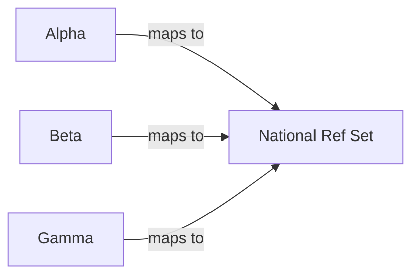

Each provider creates **CodeSystems** (local codes) and **ConceptMaps** (mappings to national content).

> **Challenge:** Everyone needs the shared national content, but must not see each other's proprietary resources.

<!--
This is a real-world scenario in Australian pathology. Each provider has their own internal order codes and needs to map them to the national standard. They all need access to the shared national content but should not see each other's proprietary mappings.
-->

---

# The Challenge

Each provider needs to:

- **See** national content but **not modify** it
- **Create and edit** their own resources only
- **Not see** other providers' resources
- Have **distinct roles**: viewer, author, approver
- **Promote** content from authoring to production

> **Key tension:** collaboration vs isolation on shared infrastructure

<!--
The fundamental challenge is multi-community isolation with fine-grained access control. Standard FHIR servers give you all-or-nothing access. We need something more nuanced.
-->

---

# Diverse Authoring Workflows

<div class="grid grid-cols-2 gap-8">
<div>

### FHIR-Native Authoring

- **Snapper** GUI for CodeSystems and ConceptMaps
- Resources authored in FHIR format from the start
- Best for: terminology experts

</div>
<div>

### CSV-in-Git Authoring

- Established governance produces **CSV artefacts**
- Automate FHIR conversion via `csv-transform.py`
- **Git repo is source of truth**
- Best for: teams with existing workflows

</div>
</div>

> **Principle:** Don't introduce new human processes — automate the translation layer instead.

<!--
Not every team will author content directly in FHIR. Many pathology providers have well-established spreadsheet-based governance processes. We should preserve those human workflows and automate the FHIR conversion.
-->

---
layout: center
class: bg-navy
---

# What We Need

## Multi-tenant isolation + RBAC + content promotion + workflow flexibility

```mermaid {theme: 'base', themeVariables: {lineColor: '#00A9CE', primaryBorderColor: '#00A9CE', primaryColor: '#E0F2F7', primaryTextColor: '#001D34'}}
graph LR
    CSV["CSV/Git"] --> T["Transform"] --> FHIR["FHIR"]
    Snap["Snapper"] --> FHIR
    FHIR --> Sec["Security Labels + RBAC"]
    Sec --> Prod["Production"]
```

<!--
This slide summarises the full picture. We need FHIR security labels for resource-level isolation, RBAC for API access control, and a content promotion pipeline. Let's dig into each piece.
-->

---
layout: center
class: bg-teal
---

# Ontoserver Security

## FHIR security labels, access control layers, and resource isolation

---

# FHIR Terminology Resources

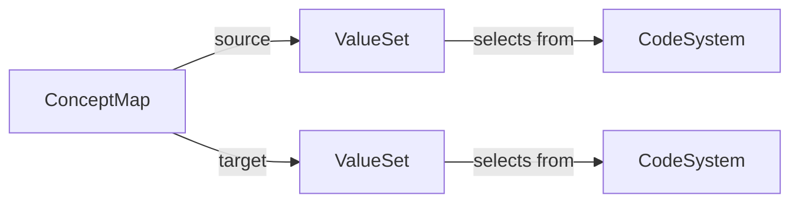

- **CodeSystem** — defines a set of codes (e.g., a provider's local order codes)
- **ValueSet** — selects a subset of concepts from one or more CodeSystems
- **ConceptMap** — declares mappings between a source and target ValueSet

These are the resources we need to protect with fine-grained permissions.

<!--
Quick refresher on the three core FHIR terminology resource types. ValueSets select from CodeSystems. ConceptMaps map between a source and target ValueSet. Each provider will have their own CodeSystems and ConceptMaps, while ValueSets like the national reference set are shared.
-->

---

# FHIR Security Labels

Security labels travel **with the resource** as part of the FHIR standard:

```json {maxHeight:'180px'}
{
  "resourceType": "CodeSystem",
  "id": "pathology-alpha-ordercodes",
  "meta": {
    "security": [
      { "system": "http://...ontoserver-permissions", "code": "ALPHA.read" },
      { "system": "http://...ontoserver-permissions", "code": "ALPHA.write" }
    ]
  }
}
```

- Labels are **portable** — they survive syndication, export, and import
- `ALPHA.read` controls visibility; `ALPHA.write` controls editing

<!--
This is the key mechanism. Ontoserver uses FHIR's built-in meta.security field to attach community labels. The read label controls who can see the resource, the write label controls who can modify it. These labels are preserved through all operations including syndication.
-->

---

# Ontoserver Security Levels

| Level | Mode | What it controls |
|-------|------|------------------|
| `false` | Open access | No authentication. Dev/test only. |
| `true` | API-level RBAC | Token required. `FHIR_READ`/`FHIR_WRITE` gate endpoints. All resources visible. |
| `fine` | Resource-level | Token required. API roles **plus** community permissions filter individual resources. |

Set via `ontoserver.security.enabled` property.

> **`fine`** is what enables multi-community isolation on shared infrastructure.
>
> Additionally, `secureSyndicated=true` protects published resources — modifying a syndicated resource requires `SYND_WRITE` (the Approver role). This prevents authors from accidentally changing production content.

<!--
Most deployments start with true for simple role-based access. The fine mode adds the resource-level filtering that makes multi-community isolation possible. The secureSyndicated setting adds write-protection for published resources, creating an approval gate between authoring and production.
-->

---

# Two-Layer Security Model

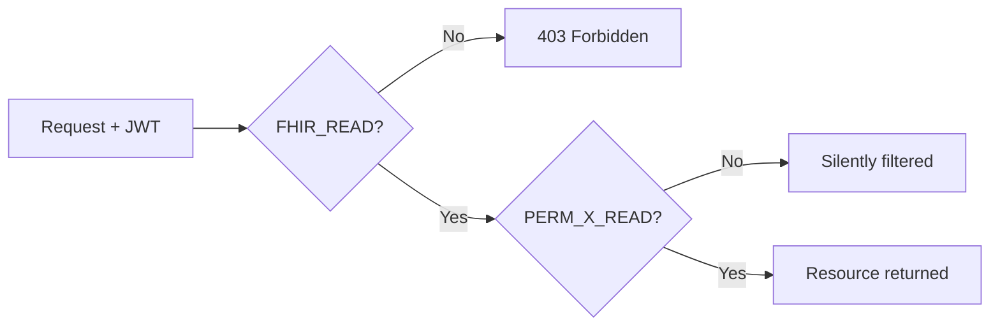

**Both layers must pass.** Having `PERM_ALPHA_READ` without `FHIR_READ` gets you nothing.

- **Layer 1** — gatekeeper: can you use the API at all?
- **Layer 2** — filter: of the resources that exist, which can you see?

<!--
Layer 1 is a gatekeeper — do you have permission to use the API? Layer 2 is a filter — which resources can you see? Note the different failure modes: Layer 1 gives an explicit 403, but Layer 2 silently removes resources from results.
-->

---

# Security Label Patterns

| Read Label | Write Label | Who can see it | Who can edit it |
|-----------|-------------|----------------|-----------------|
| `*.read` | `*.write` | Anyone with `FHIR_READ` | Anyone with `FHIR_WRITE` |
| `ALPHA.read` | `ALPHA.write` | Needs `PERM_ALPHA_READ` | Needs `PERM_ALPHA_WRITE` |
| `BETA.read` | `BETA.write` | Needs `PERM_BETA_READ` | Needs `PERM_BETA_WRITE` |
| _(no label)_ | _(no label)_ | Anyone with `FHIR_READ` | Anyone with `FHIR_WRITE` |

- **Wildcard `*`** — shared national content everyone should see
- **Community labels** — provider-specific content with read/write isolation
- **No label** — unlabelled resources are visible to any authenticated user (no community check)

> Labels are applied per-resource in `meta.security`. A single server can host resources with different community labels simultaneously.

<!--
The wildcard star pattern makes national content visible to everyone. Community-specific labels restrict access to users who have been granted that community's permissions. Unlabelled resources bypass the community check entirely — they behave like pre-fine-grained-security resources.
-->

---

# Permission Check Flow

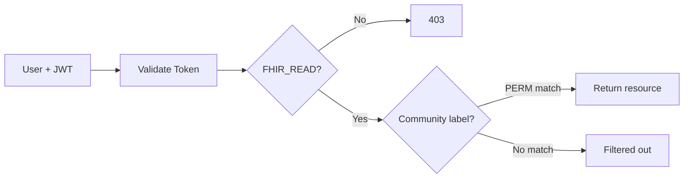

> Resources failing the community check are **silently filtered** — no errors, just absent from results.

<!--
The JWT is validated using the RSA public key. Then API-level roles are checked. If that passes, each resource is checked against the user's community permissions. Resources the user can't see simply don't appear.
-->

---
layout: center
class: bg-indigo
---

# Ontocloak

## Community management, JWT issuance, and SMART-on-FHIR

---

# What is Ontocloak?

- **Keycloak** with community management extensions
- **OAuth2/OIDC** provider — issues JWT tokens
- In production: federates via **SAML, OIDC, or LDAP**

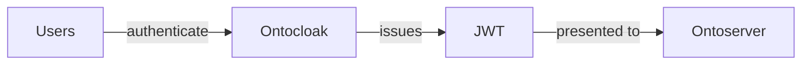

Ontocloak automates the mapping from **communities** to **Keycloak roles and groups**.

<!--
Ontocloak is Keycloak with a Communities API extension. This automates the creation of permission roles that Ontoserver checks. Without it you'd manually create all PERM roles and group mappings.
-->

---

# Communities

When you create a community (e.g., **"Pathology Alpha"**, label **`ALPHA`**), Ontocloak automatically creates:

| Created | Name |
|---------|------|
| Realm role | `PERM_ALPHA_READ` |
| Realm role | `PERM_ALPHA_WRITE` |
| Realm role | `PERM_ALPHA_OWNER` |
| Group | "Pathology Alpha consumers" → `PERM_ALPHA_READ` |
| Group | "Pathology Alpha authors" → `PERM_ALPHA_READ` + `PERM_ALPHA_WRITE` |
| Group | "Pathology Alpha owners" → `PERM_ALPHA_READ` + `PERM_ALPHA_WRITE` + `PERM_ALPHA_OWNER` |

> Just add users to groups — permissions flow automatically.

<!--
Creating a community through the API sets up the entire permission structure. You never have to manually create roles or assign them to groups.
-->

---

# User to Community to Token

**Trace for `alpha-author`:**

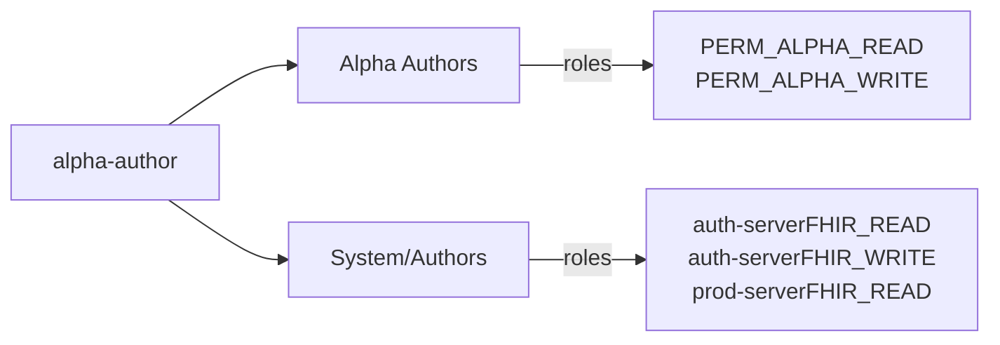

Group membership determines what appears in the JWT `authorities` claim.

<!--
alpha-author is in two groups. The Alpha authors group gives community permissions. The System/Authors group gives API-level roles. Both end up in the JWT.
-->

---

# Token Anatomy

```json {maxHeight:'160px'}
{
  "aud": ["authoring-server", "production-server"],
  "authorities": [
    "authoring-serverFHIR_READ", "authoring-serverFHIR_WRITE",
    "production-serverFHIR_READ",
    "PERM_ALPHA_READ", "PERM_ALPHA_WRITE"
  ],
  "preferred_username": "alpha-author"
}
```

- **API roles are audience-prefixed**: `authoring-serverFHIR_READ` scopes to a specific server
- **Community permissions are NOT prefixed**: `PERM_ALPHA_READ` applies everywhere
- **Single token, multiple audiences** — SSO across all servers

> This user can **read+write** on authoring, only **read** on production. They see only **Alpha** community content (plus `*` wildcard).

<!--
The audience-prefixed authorities are a key design feature. alpha-author has FHIR_WRITE only on the authoring server. On production, only FHIR_READ. Community permissions apply regardless of server.
-->

---

# Realm Configuration

## Clients, scopes, role mappings, and how tokens are assembled

| Client | Type | Purpose |
|--------|------|---------|
| `authoring-server` | Bearer-only | Resource server audience |
| `production-server` | Bearer-only | Resource server audience |
| `atomio-server` | Bearer-only | Resource server audience |
| `shrimp` | Public | Cloud-hosted FHIR browser |
| `snapper` | Public | Cloud-hosted FHIR editor |
| `atomio-ui` | Public | Cloud-hosted Atomio browser |
| `demo-cli` | Public | Setup scripts (password grant) |
| `syndication-consumer` | Confidential | Service account for feed syndication |

<!--
The realm has three categories of client: resource servers (bearer-only, define the audience and client roles), browser UIs (public, authorization code flow), and service accounts (confidential, client credentials). The browser UIs have exclude.issuer.from.auth.response set to prevent RFC 9207 issuer injection that conflicts with Shrimp's iss parameter. The syndication-consumer service account gets PERM_READ at runtime to download all community-labeled resources.
-->

---

# SMART Scope Gating

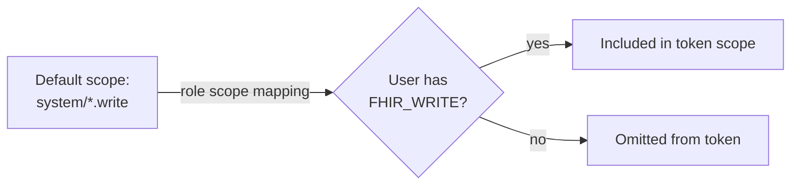

SMART scopes are **default scopes** on shrimp/snapper but **gated by role scope mappings**:

| User Role | system/*.read | system/*.write | onto/synd.write |
|-----------|:---:|:---:|:---:|
| Viewer (Consumer) | ✓ | ✗ | ✗ |
| Author | ✓ | ✓ | ✗ |
| Approver | ✓ | ✓ | ✓ |

> Snapper reads the `scope` claim to enable/disable buttons (Upload, Syndicate).

<!--
SMART scopes are default scopes on shrimp and snapper but gated by role scope mappings. Default means Keycloak considers including them without the client explicitly requesting them, but the role scope mapping checks whether the user has the required client role. This is how Snapper knows to show Upload as enabled or unauthorised — it reads the scope claim. Ontoserver checks both scope (preferred) and authorities (legacy) claims.
-->

---

# Role Hierarchy

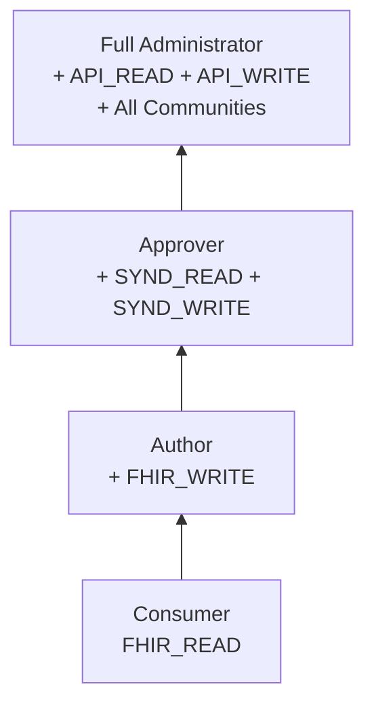

- Roles are **composites** — each builds on the previous
- Users get roles through **group membership**: `/System/Consumers`, `/System/Authors`, `/System/Approvers`
- `/System/Consumers` is the **default group** — all new users start here
- **Community groups** (e.g., "Pathology Alpha authors") are created by the Ontocloak Communities API at runtime

<!--
Roles are composites — each builds on the previous. Users get roles through group membership. The setup script assigns users to system groups, and the Ontocloak Communities API creates community-specific groups. Consumer is the default group so all new users get read-only access automatically.
-->

---

# SMART-on-FHIR Integration

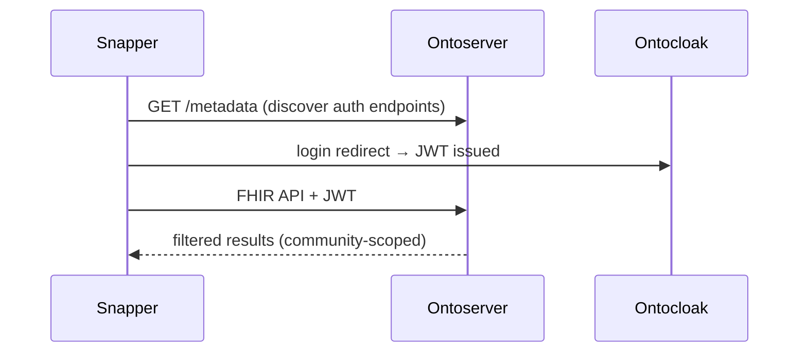

Ontoserver advertises Ontocloak's auth endpoints in its **CapabilityStatement**. SMART-on-FHIR clients like Snapper discover them automatically.

<!--
Standard OAuth2 authorization code flow. Ontoserver's CapabilityStatement advertises the correct Ontocloak endpoints, so SMART-on-FHIR clients auto-discover the authorization server.
-->

---
layout: center
class: bg-purple
---

# Demo Architecture

## Docker Compose deployment, two variants, CSV pipeline

---

# Technology Stack

| Component | Image | Port |
|-----------|-------|------|
| **Ontocloak** | `quay.io/aehrc/ontocloak:2` | 9090 |
| **Ontoserver** (Authoring) | `quay.io/aehrc/ontoserver:ctsa-6` | 9081 |
| **Ontoserver** (Production) | `quay.io/aehrc/ontoserver:ctsa-6` | 9082 |
| **Atomio** | `quay.io/aehrc/atomio:2` | 9083 |
| **PostgreSQL** | `postgres:16` | — |

All orchestrated via **Docker Compose**. Two deployment variants available.

<!--
Everything runs in Docker. PostgreSQL 16 is the database backend. Each component gets its own database.
-->

---

# Simple Variant

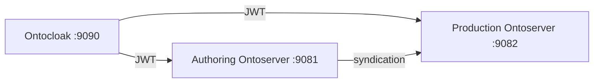

- **Direct live syndication** from authoring to production
- Best for understanding core concepts
- Configured in `simple/docker-compose.yml`

<!--
The simple variant has two Ontoserver instances: one for authoring with read-write access, one for production with read-only. Production polls the authoring server's syndication feed.
-->

---

# Atomio Variant

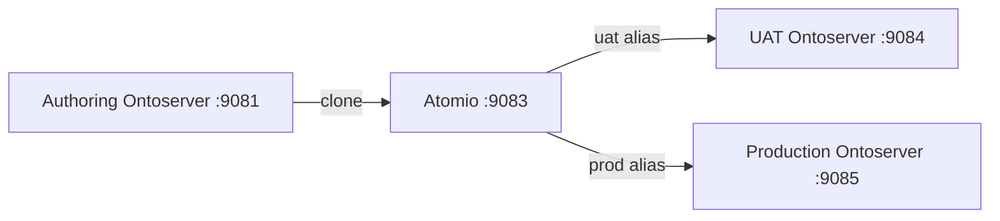

- **Release candidate management** via Atomio
- Named feeds (snapshots) with aliases for promotion
- **Rollback** by repointing an alias to a previous feed

<!--
The Atomio variant adds release management. Content is cloned into Atomio as named snapshots. Aliases point to specific feeds. Promotion is updating an alias. Rollback is repointing to the previous feed.
-->

---

# Atomio: Feeds, Aliases, and Promotion

<div class="grid grid-cols-2 gap-8">
<div>

### Key Concepts

- **Feed** — an immutable snapshot of content cloned from authoring's syndication endpoint
- **Alias** — a named pointer (e.g., `uat`, `production`) that references a feed
- Downstream servers poll an **alias URL**, not a feed directly

</div>
<div>

### Release Lifecycle

1. Author content on the authoring server
2. **Clone** the syndication feed into Atomio as a named feed (e.g., `release-1-0`)
3. Point the `uat` alias at the new feed
4. After testing, point the `production` alias at the same feed
5. **Rollback** = repoint the alias to a previous feed

</div>
</div>

> Feeds are immutable — once cloned, they never change. Promotion and rollback are just alias updates. No content is copied or rebuilt.

<!--
The key insight is the indirection layer. Downstream servers are configured once to poll an alias URL. All promotion and rollback happens by changing what the alias points to. Feeds are immutable snapshots, so you always have a known-good state to roll back to.
-->

---

# CSV-to-FHIR Pipeline

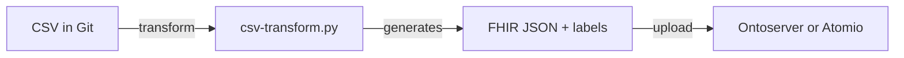

- Git repo governance is preserved — CSV is the human-editable artefact
- FHIR resources are **derived artefacts** with security labels injected automatically
- Upload destination depends on your review process:
  - **Ontoserver** — review content in authoring, then release via Atomio clone
  - **Atomio** — upload directly to a feed, then promote via aliases

> **Principle:** Automate, don't replace. The existing CSV review process continues unchanged.

<!--
The upload target depends on where content review happens. If teams review in the authoring server using Snapper or Shrimp, upload to Ontoserver and then clone into Atomio when ready. If review happens externally (e.g., in Git), upload directly to an Atomio feed and promote from there.
-->

---

# Demo Users

| User | Sees | Edits | Syndication | Authoring | Production |
|------|------|-------|-------------|-----------|------------|
| `admin` | Everything | Everything | Full | R+W | R+W |
| `alpha-viewer` | Alpha + national | — | — | R | R |
| `alpha-author` | Alpha + national | Alpha (drafts) | — | R+W | R |
| `alpha-approver` | Alpha + national | Alpha (all) | SYND_WRITE | R+W | R |
| `beta-viewer` | Beta + national | — | — | R | R |
| `beta-author` | Beta + national | Beta (drafts) | — | R+W | R |
| `beta-approver` | Beta + national | Beta (all) | SYND_WRITE | R+W | R |

All passwords: **`demo`**

- **Authors** can create/edit draft resources but **cannot modify** published (syndicated) resources
- **Approvers** have `SYND_WRITE` — can modify syndicated resources and set syndication status

<!--
The key distinction between Author and Approver is SYND_WRITE. Authors can create new content but cannot change what's already published. Approvers gate what reaches production by controlling syndication status.
-->

---
layout: center
class: bg-navy
---

# Demo Walkthrough

## Let's see it in action...

---

# Starting the Demo

Everything is controlled from a single entry point — `demo.sh`:

```bash
./demo.sh setup simple     # ~5 minutes
./demo.sh setup atomio     # ~8 minutes (adds Atomio + UAT)
```

Setup starts Ontocloak, extracts RSA keys, starts Ontoserver instances, creates communities, assigns users to groups, and loads sample FHIR resources.

> **Windows users:** Run inside [WSL2](https://learn.microsoft.com/en-us/windows/wsl/install) with Docker Desktop's WSL2 backend enabled.

The setup script offers a **manual option** — choose `[m]` when prompted to configure Ontocloak communities and user groups yourself through the admin UI.

<!--
The demo.sh script is the single entry point for all operations. It validates the variant, checks prerequisites, and delegates to the variant-specific setup scripts. Choose manual mode during setup to experience Ontocloak configuration firsthand.
-->

---

# Exploring the Demo

After setup, several ways to continue:

| Resource | What it provides |
|----------|-----------------|
| `./demo.sh walkthrough simple` | **Visual walkthrough** — automated browser demo of every scenario |
| `docs/walkthrough-simple.md` | **Written guide** — detailed step-by-step with explanations |
| **This slide deck** | **Conceptual overview** — covers the key concepts and what you'll see |

```bash
./demo.sh walkthrough simple         # Interactive — pauses at each scene
./demo.sh walkthrough simple --auto  # Auto mode — runs without pausing
./demo.sh status simple              # Check service health
./demo.sh teardown simple            # Tear down when done
```

The rest of this presentation walks through the key demo scenarios at a high level. For hands-on exploration, run the visual walkthrough or follow the written guide.

<!--
The visual walkthrough opens a browser and steps through each demo scenario automatically, including login flows, permission checks, and syndication verification. The written walkthroughs in docs/ provide the same content as text with curl commands. The demo.sh script is the central entry point for all operations.
-->

---

# Web Tools Overview

| Tool | Purpose | URL |
|------|---------|-----|
| **Shrimp** | Browse CodeSystem and ValueSet content | `https://ontoserver.csiro.au/shrimp` |
| **Snapper** | Edit CodeSystems, ConceptMaps, ValueSets | `https://ontoserver.csiro.au/snapper` |
| **OntoCommand** | Admin dashboard — loaded resources and metadata | `https://ontoserver.csiro.au/ui` |

Connect to a local server by adding `?iss=http://localhost:<port>`:
- **Authoring**: `?iss=http://localhost:9081`
- **Production**: `?iss=http://localhost:9082`

All demo users have password **`demo`**. Click **Login** to authenticate via Ontocloak.

<!--
Shrimp is best for browsing terminology content — it shows CodeSystem hierarchies and ValueSet members in detail. Snapper is the editor — it can create and modify resources and view ConceptMaps. OntoCommand shows which resources are loaded and their metadata but not their content.
-->

---

# Demo: Anonymous Access (Shrimp)

1. Open **Shrimp** pointed at production (no login):
   `https://ontoserver.csiro.au/shrimp?iss=http://localhost:9082`

2. The **CodeSystems** list is empty — all CodeSystems have community labels

3. Switch to **ValueSets** — you'll see the **National Pathology Reference Set** (`*.read` label)

> Production has `readOnly.fhir=true`, so anonymous users get implicit `FHIR_READ`. But community-labeled resources (e.g., `ALPHA.read`) require the matching `PERM` role in a JWT — they are silently filtered.

<!--
Without logging in, only wildcard-labeled resources are visible. The national content is accessible to everyone, but provider-specific content is completely hidden. The user has no way of knowing other resources exist.
-->

---

# Demo: Log In as Alpha Author (Shrimp)

1. In **Shrimp** (authoring), click **Login**
   `https://ontoserver.csiro.au/shrimp?iss=http://localhost:9081`

2. Authenticate as **alpha-author** / **demo**

3. Browse **CodeSystems** — you now see:
   - **Pathology Alpha Local Order Codes** (has `ALPHA.read` label)
   - The national content (`*.read`)

4. Search for "Beta" or "Gamma" CodeSystems — **nothing appears**

> Alpha-author's token has `PERM_ALPHA_READ`. Resources labeled `BETA.read` or `GAMMA.read` are silently filtered — Alpha never knows they exist.

<!--
This is the core isolation demo. After logging in as alpha-author, Shrimp shows only the resources matching the user's community permissions. The FHIR API returns different results based on the JWT claims, and Shrimp reflects that directly.
-->

---

# Demo: Same Server, Different Views

<div class="grid grid-cols-2 gap-8">
<div>

### As beta-author:

1. **Log out**, then log in as **beta-author** / **demo**
2. Browse CodeSystems
3. See only **Pathology Beta** CodeSystem + national content
4. Alpha and Gamma are invisible

</div>
<div>

### As admin:

1. **Log out**, then log in as **admin** / **demo**
2. Browse CodeSystems
3. See **all three**: Alpha, Beta, Gamma CodeSystems + national content

</div>
</div>

> Same Shrimp URL, same server — the resource list changes based on who is logged in. The admin has `PERM_READ` (wildcard), so all community-labeled resources are visible.

<!--
This is the most impactful demo moment. Switching users on the same server and watching the resource list change makes the isolation model tangible. The admin sees everything because PERM_READ is the wildcard community permission.
-->

---

# Demo: Viewer vs Author (Snapper)

1. Open **Snapper** (authoring):
   `https://ontoserver.csiro.au/snapper?iss=http://localhost:9081`

2. Log in as **alpha-viewer** / **demo**

3. Open the **Alpha CodeSystem** — you can **browse** it

4. Try to **edit** a concept (e.g., change a display name) — **Save fails** with 403

5. **Log out**, log in as **alpha-author** / **demo**

6. Open the same Alpha CodeSystem — now you **can edit and save**

> alpha-viewer has `PERM_ALPHA_READ` but lacks `PERM_ALPHA_WRITE`. The server returns 403 Forbidden on write attempts.

<!--
Snapper provides the editing interface. Viewers can open and read resources but the server rejects any modifications. Authors in the same community can successfully save changes. This demonstrates the read/write split in community permissions.
-->

---

# Demo: Author Blocked on Published Resource

1. In **Snapper** (authoring), logged in as **alpha-author**

2. Open **Pathology Alpha Local Order Codes** CodeSystem (version 1.0.0 — published)

3. Try to modify the resource — **Save fails** with **403 Forbidden**

4. alpha-author has `FHIR_WRITE` but **NOT** `SYND_WRITE`

> Published resources are protected by `secureSyndicated`. Authors cannot accidentally modify what's already flowing to production. They must create a new business version instead.

<!--
This is a critical governance feature. The secureSyndicated setting adds a write-protection layer on top of normal FHIR permissions. Authors need SYND_WRITE to modify syndicated resources, which only the Approver role provides.
-->

---

# Demo: Author Creates New Business Version

Since the published 1.0.0 is locked, the author creates **version 1.1.0** — a new resource instance:

1. Load the published CodeSystem 1.0.0 as a starting point
2. Change version to **1.1.0**, add new concept:
   - Code: `D-DIM`
   - Display: `D-Dimer`
   - Definition: `D-dimer test for thrombosis screening`
3. Save with a **new resource ID** → **201 Created**

The new version is a **draft** — no syndication status, not in the feed.

> Authors create new versions rather than modifying published ones. This preserves the production-published resource and creates a clear audit trail of changes.

<!--
The key insight is that a new business version is a separate FHIR resource instance. It shares the same canonical URL but has a different version and resource ID. The published 1.0.0 remains untouched.
-->

---

# Demo: Approver Publishes New Version

1. **Log out**, log in as **alpha-approver** (has `SYND_WRITE`)

2. Review the new CodeSystem 1.1.0

3. Set **syndication status = true** via the `/synd/setSyndicationStatus` API

4. Version 1.1.0 now appears in the **syndication feed**

5. Downstream servers pick it up on their next sync cycle

> The approver is the gatekeeper. Only users with `SYND_WRITE` can publish resources to the feed. This creates an explicit approval step between authoring and production.

<!--
The setSyndicationStatus API is the approval mechanism. Once set, the resource enters the syndication feed and flows downstream. In the Atomio variant, the next feed clone would include it.
-->

---

# Demo: Viewing ConceptMaps (Snapper)

1. In **Snapper** (authoring), logged in as **alpha-author**

2. Navigate to **ConceptMaps**

3. Open **Alpha Local Codes to National Standard** — see mappings from local codes to national codes:

| Local Code | National Code | Equivalence |
|-----------|-----------|-------------|
| FBC | NAT-CBC (Full blood count) | equivalent |
| BGL | NAT-GLUC (Blood glucose) | equivalent |
| HBA1C | NAT-HBA1C (Hemoglobin A1c) | equivalent |

4. Try searching for Beta's ConceptMap — **not visible**

> ConceptMaps are also community-labeled. Snapper shows ConceptMap content that Shrimp does not.

<!--
Snapper is the right tool for viewing ConceptMaps since Shrimp doesn't support them. The mappings show how each provider's local codes map to the national standard.
-->

---

# Demo: Syndication to Production

1. Open **OntoCommand** (authoring):
   `https://ontoserver.csiro.au/ui?iss=http://localhost:9081`

2. Log in as **admin** — see all loaded resources and their metadata

3. Open **OntoCommand** (production):
   `https://ontoserver.csiro.au/ui?iss=http://localhost:9082`

4. Compare — production has the **same resources** (synced every 2 min)

5. Open **Shrimp** on production, log in as **alpha-author** — see the same Alpha resources that were on authoring

- Production uses `syndication-consumer` service account (OAuth2 client credentials)
- This account has `PERM_READ` — downloads **all** community-labeled resources
- Security labels are **preserved** — end users still only see what their token allows

<!--
OntoCommand shows the full inventory of loaded resources. Comparing authoring and production dashboards confirms syndication is working. Even though the syndication consumer downloads everything, end users on production still only see their community's content.
-->

---

# Demo: CSV-to-FHIR Pipeline

Pathology Gamma maintains codes in CSV (Git-managed):

```bash
# Source CSV
head -3 ../common/csv-data/gamma-codes.csv
# code,display,definition
# GLU-R,Random Glucose,Random blood glucose level
# GLU-F,Fasting Glucose,Fasting blood glucose level
```

```bash
# Transform to FHIR with security labels
python3 ../common/scripts/csv-transform.py \
  --codes ../common/csv-data/gamma-codes.csv \
  --mappings ../common/csv-data/gamma-mappings.csv \
  --output-dir ./generated \
  --security-label GAMMA \
  --codesystem-url http://pathology-gamma.example.com/\
CodeSystem/pathology-codes \
  --publisher "Pathology Gamma"
```

> The setup script runs this automatically. Security labels (`GAMMA.read`, `GAMMA.write`) are injected by the `--security-label` flag. The team's existing CSV governance process is preserved.

<!--
This step is necessarily CLI-based since it's a build pipeline operation. The CSV transform preserves the team's existing workflow. They edit CSVs in Git with their normal review process. The script generates FHIR JSON with correct security labels.
-->

---

# Demo: Verify CSV Content in Shrimp

After the CSV resources are loaded by the setup script:

1. Open **Shrimp** (authoring):
   `https://ontoserver.csiro.au/shrimp?iss=http://localhost:9081`

2. Log in as **admin** / **demo**

3. Browse CodeSystems — find **Pathology Gamma** (15 concepts from CSV)

4. Explore the codes: GLU-R, GLU-F, HBA1C, CHOL-T, TSH, etc.

5. **Log out**, log in as **alpha-author** — Gamma CodeSystem **disappears**
   (requires `PERM_GAMMA_READ`)

> In a CI/CD pipeline, the CSV transform and upload would be automated — Git push triggers transform and upload to the authoring server.

<!--
Shrimp lets you verify the CSV-generated content visually. The 15 Gamma pathology codes are browsable just like any other CodeSystem. And the community isolation still applies — only users with PERM_GAMMA_READ can see them.
-->

---
layout: center
class: bg-teal
---

# Atomio Release Workflow

## Release candidates, aliases, and promotion pipeline

---

# Atomio: List Feeds and Aliases

```bash
# List all feeds (release snapshots)
curl -s http://localhost:9083/feed \
  | jq '.[] | {name: .name, title: .title}'
# {"name":"release-1-0","title":"Release 1.0"}

# List aliases (pointers to feeds)
curl -s http://localhost:9083/alias \
  | jq '.[] | {alias: .aliasName, feed: .feedName}'
# {"alias":"uat","feed":"release-1-0"}
# {"alias":"production","feed":"release-1-0"}
```

```bash
# View feed contents as Atom XML (what Ontoserver consumes)
curl -s http://localhost:9083/feed/release-1-0/syndication.xml \
  | head -20
```

> Atomio also has a Swagger UI at `http://localhost:9083/swagger-ui/index.html`

<!--
Feeds are immutable snapshots of content. Aliases are named pointers that downstream servers poll. This indirection is what enables promotion and rollback without touching downstream configuration.
-->

---

# Atomio: Create Release Candidate

After making changes on authoring, clone the feed into Atomio:

```bash
# Clone authoring's syndication feed into a new snapshot
curl -s -o /dev/null -w "%{http_code}" -X POST \
  "http://localhost:9083/feed/\$clone\
?name=release-2-0\
&url=http://authoring-ontoserver:8080/synd/syndication.xml"
# Output: 200
```

```bash
# Verify both feeds exist
curl -s http://localhost:9083/feed | jq '.[].name'
# "release-1-0"
# "release-2-0"
```

- Clone captures a **point-in-time snapshot** of all published resources
- Feed names must match `^[A-Za-z0-9-_]+$` (no dots)
- Both releases are now immutable and independently available

<!--
The clone downloads all artefacts from the authoring syndication feed. This is an immutable snapshot — even if authoring content changes afterwards, release-2-0 stays the same. Feed names can't contain dots, so use release-2-0 not release-2.0.
-->

---

# Atomio: Promote to UAT, then Production

```bash
# Step 1: Promote release-2-0 to UAT
curl -s -o /dev/null -w "%{http_code}" -X PUT \
  http://localhost:9083/alias/uat \
  -H "Content-Type: application/json" \
  -d '{"aliasName":"uat","feedName":"release-2-0"}'
# Output: 200

# Step 2: After UAT testing, promote to production
curl -s -o /dev/null -w "%{http_code}" -X PUT \
  http://localhost:9083/alias/production \
  -H "Content-Type: application/json" \
  -d '{"aliasName":"production","feedName":"release-2-0"}'
# Output: 200

# Verify alias state
curl -s http://localhost:9083/alias \
  | jq '.[] | {alias: .aliasName, feed: .feedName}'
```

> UAT/Production Ontoservers poll their alias URL every 2 minutes and automatically pick up the new content.

<!--
Promotion is a single PUT to change an alias pointer. The downstream Ontoservers are configured to poll the alias URL, so they automatically pick up new content on their next polling cycle. No restart needed.
-->

---

# Atomio: Instant Rollback

If issues are found in production, rollback is a single API call:

```bash
# Rollback production to release-1-0
curl -s -o /dev/null -w "%{http_code}" -X PUT \
  http://localhost:9083/alias/production \
  -H "Content-Type: application/json" \
  -d '{"aliasName":"production","feedName":"release-1-0"}'
# Output: 200
```

```bash
# UAT continues testing release-2-0 independently
curl -s http://localhost:9083/alias \
  | jq '.[] | {alias: .aliasName, feed: .feedName}'
# {"alias":"uat","feed":"release-2-0"}
# {"alias":"production","feed":"release-1-0"}
```

- All feed snapshots are **immutable** and preserved
- Rollback is instant — no rebuild, no re-syndication
- UAT and production can point to **different releases** simultaneously

<!--
Because feeds are immutable snapshots, rollback is just repointing the alias. The previous content is still there. Production picks up the change on the next poll cycle, typically within 2 minutes.
-->

---

# Atomio: Web UI

The hosted Atomio UI provides a graphical interface for release management:

`https://ontoserver.csiro.au/atomio/?iss=http://localhost:9083`

From the UI you can:
- Browse **feeds** and their entries
- Create **snapshot feeds** from syndication sources
- Move **aliases** between feeds (promote/rollback)
- View feed **syndication XML**

> For automation, use the REST API as shown in the curl examples. The UI is useful for manual release management and visibility.

<!--
The Atomio UI is built on the same API we've been demonstrating. It provides a visual overview of feeds and aliases, making it easy to see the current state of your release pipeline.
-->

---
layout: center
class: bg-navy
---

# Summary

## What we demonstrated

---

# Key Takeaways

- **FHIR security labels** enable resource-level isolation on shared infrastructure
- **Ontocloak** automates community-to-permission mapping
- **Audience-prefixed authorities** provide proper token scoping across servers
- **Syndication governance** — published resources are protected; authors create new versions, approvers publish them
- **Syndication preserves security** — labels travel with resources end-to-end
- **Atomio** adds controlled release management with instant rollback
- **Existing workflows preserved** — automate the translation, don't replace processes

> Multi-community terminology authoring is possible without separate server instances per organisation.

<!--
The combination of FHIR security labels, Keycloak community management, and proper token scoping gives us true multi-community isolation on shared FHIR infrastructure.
-->

---
layout: center
---

# Resources

| | |
|---|---|
| **Ontoserver** | ontoserver.csiro.au |
| **Ontocloak** | ontoserver.csiro.au/site/our-solutions/ontocloak/ |
| **Atomio** | ontoserver.csiro.au/site/our-solutions/atomio/ |
| **Snapper** | ontoserver.csiro.au/snapper |

### Questions?

<div class="logo">
  
</div>

<!--
Thank you for your attention. Happy to take questions about the security model, syndication, Atomio, or any other aspect of the demo.
-->
